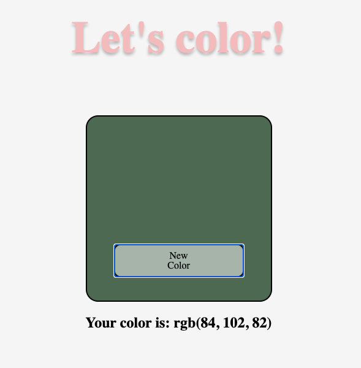

# Random color generator

Users can click to generate randoms colors and the program will inform you which
RGB colors it is. Button displays in complementary color (light vs dark shade)

Created in Sept 2020 by Jenna Koelbl
Uses Emotion, CSS sheets and JSX styling

https://emotion.sh/docs/introduction

## Netlify

https://wizardly-snyder-f2a9c9.netlify.app

## Sandbox

https://codesandbox.io/s/github/jaylenej27/react-color-generator

## Screenshot

